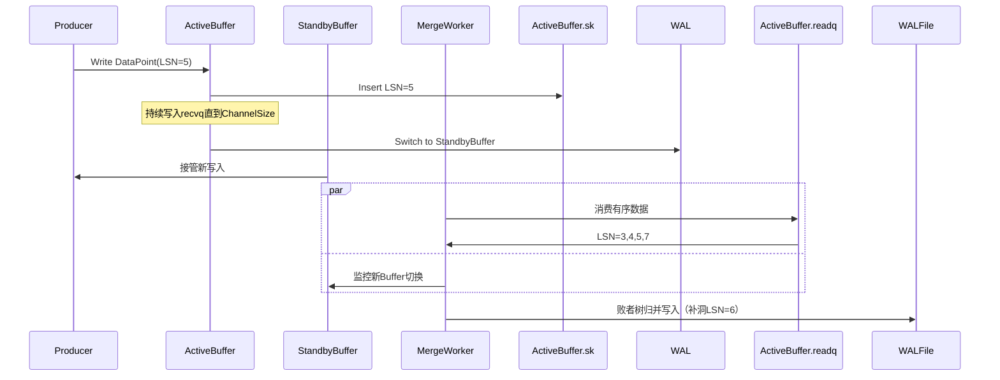

# wal
基于Go实现的高可用、高性能的WAL机制

## 1. WAL日志格式定义
| LSN    | 分片类型   | Length | CRC校验  |
|--------|--------|--------|--------|
| 8bytes | 2bytes | 8bytes | 4bytea |

LSN: 
    每一条数据都有一个LSN，这个LSN是全局唯一且单调递增的，用于对数据进行排序，保证全局有序。

分片类型：
    
- All: 当前数据块包含完整的一条日志数据
- Header：当前数据块只包括一条完整日志的头部元数据
- Middle: 日志内容超过了一个块的大小，中间块存储了一部分，假如一个日志的内容横跨了3个块
那么，前两个块的分片类型都是Middle，最后一个分块为End
- End：一条日志的结尾部分

